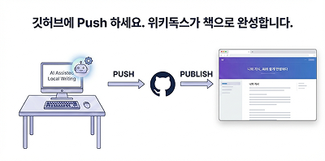

**깃허브 연동**은 위키독스의 책 내용을 깃허브 리포지토리와 동기화하는 기능입니다.

## 연동의 개념

기존에는 위키독스 웹 에디터에서 직접 내용을 작성했습니다. 깃허브 연동을 사용하면 깃허브 리포지토리의 마크다운 파일이 위키독스에 자동으로 반영됩니다.

```
[깃허브 리포지토리] --push--> [자동 동기화] --반영--> [위키독스 책]
```

## 동작 방식

### 1. 리포지토리 연결

위키독스 책과 깃허브 리포지토리를 연결합니다. 연결 후에는 리포지토리의 변경사항이 자동으로 위키독스에 반영됩니다.

### 2. 마크다운 작성

로컬 환경이나 깃허브에서 마크다운 파일을 작성합니다. 익숙한 에디터(VS Code, Vim 등)를 사용할 수 있습니다.

### 3. 자동 동기화

`main` 브랜치에 변경사항을 push하면 위키독스가 이를 감지하고 자동으로 내용을 업데이트합니다.

## 파일 구조

깃허브 연동을 위한 기본 파일 구조는 다음과 같습니다.

```
repository/
├── TOC.md          # 목차 정의
├── pages/          # 페이지 파일들
│   ├── 01-intro.md
│   └── 02-setup.md
└── assets/         # 이미지 등 정적 파일
    └── diagram.png
```

## 이미지 첨부의 예

image_sample.png라는 파일을 assets 폴더에 업로드하고 다음과 같이 작성합니다.

```plaintext

```

그러면 다음과 같이 표시됩니다.


## 연동의 핵심 요소

| 요소 | 역할 |
|------|------|
| TOC.md | 책의 목차 구조 정의 |
| pages/ | 각 페이지의 마크다운 내용 |
| assets/ | 이미지, 다이어그램 등 |

다음 챕터에서는 이러한 연동이 제공하는 다양한 장점에 대해 알아보겠습니다.
